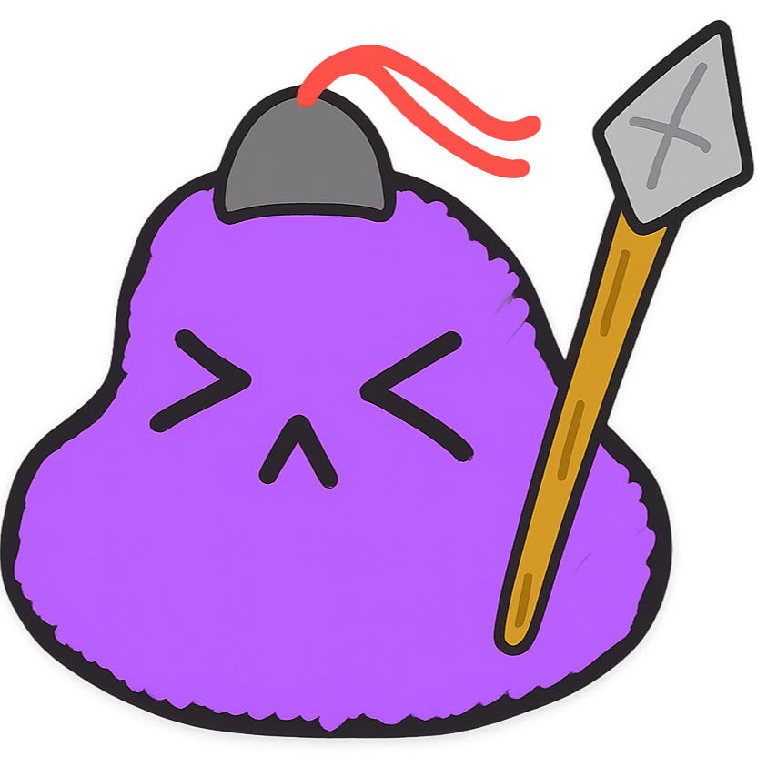
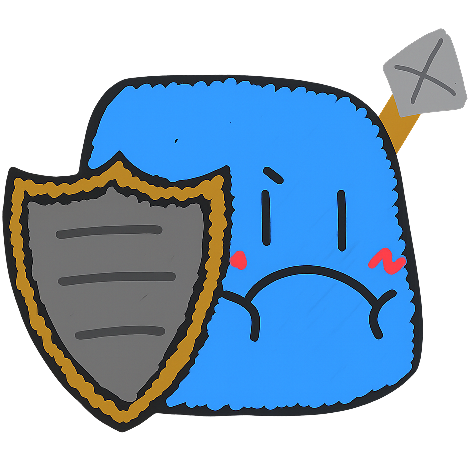
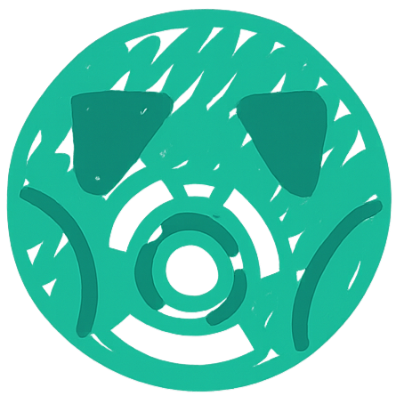

# 🎮 Note Survive - 2D 생존 로그라이크 게임

## 📖 게임 소개
**Note Survive**는 메모장 위에서 펼쳐지는 생존 게임입니다. 적을 처치하고 무기를 업그레이드하며 **5분을 살아남으면 승리**합니다. 다양한 속성 조합 시스템과 전략적인 무기 선택이 핵심입니다.

---

## 🚀 게임 실행 방법
1. `index.html` 파일을 웹 브라우저로 열기
2. 플레이어를 **WASD 또는 방향키**로 이동
3. **Game Start** 버튼 위로 이동 후 **SPACE** 키로 게임 시작
4. **Description** 버튼으로 상세 게임 설명 확인

---

## 🎯 게임 목표

### 승리 조건
- ⏱️ **5분 생존**: 타이머가 0이 되면 승리
- 💚 **HP 관리**: 시간이 지날수록 HP 지속 감소 (1~10)
- 🔄 **HP 회복**: 적 처치 시 HP 10 회복

### 패배 조건
- ❤️ HP가 0이 되면 게임 오버

### 플레이어 스펙
- **초기 HP**: 100
- **피격 피해**: (기본 10) + (맞은 횟수 × 5)
- **이동**: WASD 또는 방향키

---

## 🕹️ 조작법

| 키 | 기능 |
|---|---|
| **W / ↑** | 위로 이동 |
| **S / ↓** | 아래로 이동 |
| **A / ←** | 왼쪽으로 이동 |
| **D / →** | 오른쪽으로 이동 |
| **E** | 속성 부여 (무기 보유 시) |
| **SPACE** | 메인 메뉴 버튼 선택 |
| **ESC** | 일시정지 메뉴 |

---

## 👾 적 능력치 시스템

적은 **체력(HP)**, **방어구(Armor)**, **방어력(Defense)** 3가지 능력치를 가집니다.

### 📊 능력치 구조
```
┌─────────────┐
│  방어구     │ ← 방어력 영향 X, 먼저 소모
├─────────────┤
│  체력       │ ← 방어력 적용 (피해 감소율)
└─────────────┘
```

### 🎨 체력바 색상
- 🔴 **빨간색**: 방어력 0%
- 🟡 **노란색**: 방어력 1% 이상

---

## 🔥 몬스터 종류

### 1️⃣ 일반 몬스터


- 가장 기본이 되는 몬스터
- 균형잡힌 능력치

### 2️⃣ 탱커 몬스터


- **방어구 5배** (일반 대비)
- 높은 내구력

### 3️⃣ 강화 몬스터


- **방어력 95%**
- 피해 감소율 극대화

---

## ✨ 속성 시스템

### 🎟️ 속성 부여권
- ⏰ **1분마다 1개 지급** (최대 4개)
- 🔑 무기 보유 시 **E키**로 사용
- ⚠️ **제약사항**:
  - 같은 속성 연속 부여 불가
  - 2차 속성에 1차 속성 부여 불가

---

## ⚙️ 속성 종류

### 🔹 물리 속성


**물리 (Physics)**
- 기본 속성, 특수 효과 없음

---

### 🔸 1차 속성

<table>
<tr>
<td width="50%">

**🔥 불 (Fire)**

- 초당 최대 체력의 **5%** 피해 (DoT)

**❄️ 얼음 (Ice)**

- **4초** 동안 둔화

</td>
<td width="50%">

**☠️ 독 (Poison)**

- 초당 **50** 고정 피해
- 방어구 무시, 방어력 적용

**⚡ 전기 (Electric)**

- **0.3초** 쇼크 (기절)

</td>
</tr>
</table>

---

### 🔹 2차 속성 (조합)

<table>
<tr>
<td width="50%">

**☢️ 방사능 (불 + 전기)**

- 받는 피해량 **1.5~3배** 증가
- 피격마다 스택 증가

**🧲 자성 (얼음 + 전기)**

- **20% 확률**로 보호막 파괴

**🧪 부식 (독 + 전기)**

- 방어력 **20~80%** 감소
- 피격마다 스택 증가 (최대 4스택)

</td>
<td width="50%">

**💨 가스 (불 + 독)**

- **50% 확률**로 5초 지속 가스 생성
- 범위형 DoT (방어구 무시)

**🦠 바이러스 (얼음 + 독)**

- 최대 체력의 **20%** 고정 피해
- 방어구, 방어력 완전 무시

**💥 폭발 (불 + 얼음)**

- 적 처치 시 **범위 피해**
- 연쇄 폭발 없음

</td>
</tr>
</table>

---

## ⚔️ 무기 시스템

### 📋 기본 규칙
- **최대 2개** 무기 보유 가능
- **레벨업**으로 무기 업그레이드
- **최대 레벨 5** (이후 버프 카드 획득)
- 모든 무기는 **자동 공격**

---

### 🔫 무기 목록 (14종)

#### 🔄 궤도형 무기
1. **회전 수리검** (물리)
   - 플레이어 주변 영구 회전
   - 근접 자동 방어

#### 📡 파동형 무기
2. **파동 생성기** (물리)
   - 충격파로 광역 둔화
   
3. **안개 생성기** (독)
   - 지속 피해 안개 생성

4. **전기 방어막** (전기)
   - 방어막 범위 지속 피해

#### 🎯 발사체 무기
5. **화염 방사기** (불)
   - 근거리 지속 화염
   
6. **냉기 방사기** (얼음)
   - 둔화 효과 냉기

7. **기관총** (물리)
   - 빠른 연사

8. **샷건** (물리)
   - 5방향 산탄

9. **로켓** (불)
   - 폭발 범위 피해

#### 🪃 투척형 무기
10. **야구 방망이** (물리)
    - 근접 넉백

11. **부메랑** (물리)
    - 왕복 관통 공격

12. **바람 칼날** (물리)
    - 원거리 관통

#### ⭐ 특수 무기
13. **회전 레이저** (전기)
    - 360도 회전 레이저

14. **폭죽** (물리)
    - 광역 폭발 설치

---

## 📊 레벨업 시스템

### 🎴 레벨업 카드 (3장 중 1장 선택)

#### 📈 무기 업그레이드
- 보유 무기 레벨업
- 레벨 5 도달 시 더 이상 표시 안됨

#### 🆕 새 무기 획득
- 랜덤 무기 획득
- 최대 2개 보유 시 표시 안됨

#### ⚡ 5초 버프 (레벨 5 도달 후)
- **공격력 200%**: 피해량 2배
- **이동속도 30%**: 속도 1.3배
- **흡혈 2배**: 회복량 20으로 증가
- **적 둔화 50%**: 모든 적 느려짐

---

## 🎮 게임 전략

### ✅ 초반 전략
1. 무기 2개 빠르게 확보
2. 물리 속성 → 1차 속성 변환
3. HP 관리 우선

### ✅ 중반 전략
1. 2차 속성 조합 연구
2. 무기 레벨 5 달성
3. 버프 카드 적극 활용

### ✅ 후반 전략
1. 2차 속성 극대화
2. 버프 연계 공격
3. 안전 거리 유지

### 🔥 추천 조합
- **폭발 빌드**: 불 + 얼음 → 연쇄 폭발
- **디버프 빌드**: 방사능/부식 → 피해 증폭
- **안전 빌드**: 바이러스 → 확정 피해
- **CC 빌드**: 전기 + 얼음 → 기절 + 둔화

---

## 🛠️ 기술 스택
- **HTML5 Canvas**: 2D 그래픽 렌더링
- **JavaScript (ES6+)**: 게임 로직
- **CSS3**: UI/UX 스타일링

---

## 📁 파일 구조
```
기말고사/
├── index.html              # 메인 메뉴 (인터랙티브 버튼)
├── test.html               # 게임 화면
├── css/
│   └── style.css           # 전역 스타일
├── js/
│   ├── main.js             # 메뉴 로직 & 팝업
│   ├── test.js             # 게임 엔진 & 루프
│   ├── player.js           # 플레이어 시스템
│   ├── enemy.js            # 적 AI & 생성
│   ├── weapon.js           # 14종 무기 & 속성
│   ├── exp.js              # 경험치 & 레벨업
│   └── map.js              # 맵 렌더링
├── images/                 # 게임 리소스
│   ├── normal.png          # 일반 몬스터
│   ├── tank.png            # 탱커 몬스터
│   ├── enchance.png        # 강화 몬스터
│   ├── fire.png            # 불 속성
│   ├── froz.png            # 얼음 속성
│   ├── poiz.png            # 독 속성
│   ├── elec.png            # 전기 속성
│   ├── radioactivity.png   # 방사능
│   ├── magne.png           # 자성
│   ├── corr.png            # 부식
│   ├── gas.png             # 가스
│   ├── virus.png           # 바이러스
│   ├── explo.png           # 폭발
│   └── ...                 # 기타 이미지
└── README.md               # 이 문서
```

---

## 🎨 게임 특징

### ✨ 핵심 시스템
- ✅ **속성 조합 시스템**: 1차 + 1차 = 2차 속성
- ✅ **전략적 무기 선택**: 최대 2개 제한
- ✅ **레벨 5 버프 시스템**: 강력한 5초 버프
- ✅ **3단계 적 능력치**: 체력/방어구/방어력
- ✅ **인터랙티브 메인 메뉴**: 플레이어 이동식 버튼
- ✅ **상세 게임 설명 팝업**: 이미지 포함 튜토리얼

### ⚡ 게임플레이
- ✅ **DeltaTime 기반**: 프레임 독립적 실행
- ✅ **자동 타겟팅**: 가장 가까운 적 공격
- ✅ **화면 중앙 고정**: 플레이어 중심 카메라
- ✅ **메모장 테마**: 노란 배경 + 빨간 상단선

---

## 🏆 개발 완료 기능

### ✅ 핵심 메커니즘
- [x] 5분 타이머 시스템
- [x] HP 지속 감소 (1~10)
- [x] 적 처치 HP 회복 (10)
- [x] 피격 누적 피해 증가
- [x] 승리 조건 (타이머 0)

### ✅ 속성 시스템
- [x] 물리/1차/2차 속성
- [x] 속성 부여권 (1분마다)
- [x] 속성 조합 로직
- [x] 속성별 효과 구현

### ✅ 전투 시스템
- [x] 14종 무기 구현
- [x] 무기 레벨업 (최대 5)
- [x] 5초 버프 카드
- [x] 3단계 적 능력치
- [x] 몬스터 3종 (일반/탱커/강화)

### ✅ UI/UX
- [x] 인터랙티브 메인 메뉴
- [x] 게임 설명 팝업
- [x] 레벨업 카드 선택
- [x] 승리/패배 화면
- [x] 일시정지 메뉴

---

## 📝 업데이트 노트

### v1.0.0 (2025-12-07)
- 🎉 **정식 릴리즈**
- ✨ 속성 조합 시스템 완성
- ✨ 14종 무기 밸런스 조정
- ✨ 메인 메뉴 인터랙티브화
- ✨ 상세 게임 설명 팝업 추가
- 🐛 버그 수정 및 최적화

---

## 👨‍💻 개발자
**2D 게임 프로그래밍 기말 프로젝트**
- 신라대학교 컴퓨터공학부

---

## 📄 라이선스
이 프로젝트는 교육 목적으로 제작되었습니다.

---

## 🎯 플레이 팁

### 💡 생존 요령
1. **초반**: 무기 2개 빠르게 확보
2. **중반**: 속성 조합으로 2차 속성 획득
3. **후반**: 버프 카드 적극 활용
4. **항상**: HP 0 되지 않도록 관리

### 🏆 고득점 전략
- 강화 몬스터 우선 처치 (경험치 많음)
- 2차 속성 조합 마스터
- 버프 카드 타이밍 계산
- 안전 거리 유지하며 플레이

---

**🎮 즐거운 게임 되세요! 🎮**
